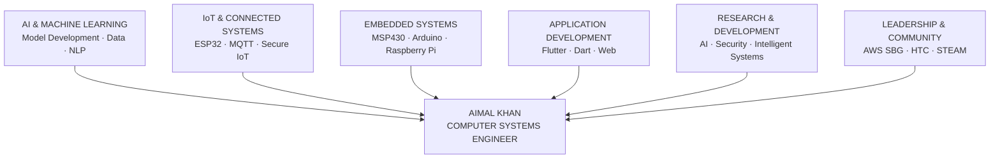

<div align="center">


<br/>

<a href="https://linkedin.com/in/aimal-khan-3a27a8324">

</a>
<a href="mailto:cseaimal@gmail.com">

</a>
<a href="https://github.com/cseaimal">

</a>
<a href="https://instagram.com/aimal_pk">

</a>

<br/><br/>


</div>

---

# `01` — ABOUT

I'm **Aimal Khan**, a **Computer Systems Engineering student at UET Peshawar** interested in building intelligent systems that connect software, hardware, and real-world applications.

My work and learning span **AI, IoT, embedded systems, Flutter, web development, and applied research**.

I have worked with platforms including **ESP32, Arduino, MSP430, Raspberry Pi, and FPGA**, while also developing software applications using **Flutter, Dart, and modern web technologies**.

Alongside engineering, I lead student technology communities and initiatives focused on **cloud computing, AI, engineering, and STEAM education**.

> **Build. Learn. Lead.**

---

## `ENGINEERING FOCUS`

| AREA         | FOCUS                                    |
| ------------ | ---------------------------------------- |
| `AI`         | Machine Learning · AI Model Development  |
| `IoT`        | Secure IoT · MQTT · Connected Systems    |
| `EMBEDDED`   | ESP32 · Arduino · MSP430 · Raspberry Pi  |
| `SOFTWARE`   | Flutter · Dart · Web Development         |
| `RESEARCH`   | Applied AI · Embedded Systems · Security |
| `LEADERSHIP` | AWS SBG · Hiking & Trekking Club         |
| `EDUCATION`  | STEAM · Robotics · Technology            |

---

# `02` — TECHNICAL DIRECTION



---

# `03` — CURRENTLY

* Building and experimenting with **AI and machine learning systems**
* Developing applications with **Flutter and Dart**
* Exploring **secure IoT and embedded systems**
* Working on **research-oriented engineering projects**
* Leading technology initiatives through **AWS Student Builder Group at UET Peshawar**
* Promoting **technology and STEAM education**

---

# `04` — TECHNOLOGY

<div align="center">


</div>

---

# `05` — PROJECTS

### AI & Intelligent Systems

Developing practical AI solutions focused on real-world data, automation, and intelligent decision-making.

### Secure IoT

Building connected systems using microcontrollers, communication protocols, and security concepts.

### Flutter Applications

Designing and developing cross-platform applications with a focus on clean interfaces and practical functionality.

### Embedded Systems

Working with microcontrollers, sensors, communication modules, and hardware-software integration.

---

# `06` — LEADERSHIP

### AWS Student Builder Group — UET Peshawar

**Leader**

Leading a student community focused on **cloud computing, AI, technical learning, and developer growth**.

### Hiking & Trekking Club — UET Peshawar

**Captain**

Leading student activities focused on **exploration, teamwork, leadership, and outdoor education**.

---

# `07` — PHILOSOPHY

```text
Engineering is not just about writing code.

It is about understanding problems,
building practical solutions,
and continuously learning.

Learn deeply.
Build consistently.
Lead responsibly.
```

---

<div align="center">

### Let's build something meaningful.


</div>
